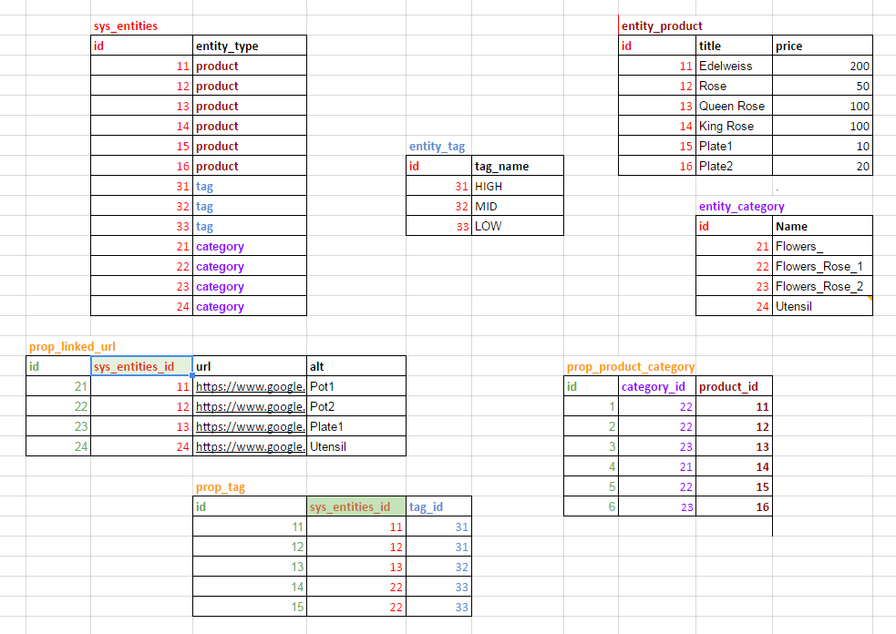

# EAV example

# Структура таблиц

Выполните 
Запустите скрипт `script/install.php`, он [создаст таблицы](https://docs.google.com/spreadsheets/d/1k51Dtv1z-eK_ic5TXJMdJ9_jeLBtcrKQPQI9A0Jpts0/edit#gid=0) примера в базе.  

  

Для тог, что бы создать такую структуру с данными, выполните инструкции по  
[установке библиотеки](INSTALL.md "установка библиотеки zaboy-rest") и по  
[запуску тестов](TESTS.md "Подготовка к запуску тестов").
Потом выполните скрипт `script/install.php`, он создаст таблицы с данными в базе.

## Теперь должно работать: ##

[http://zaboy-rest.loc//api/rest/entity_tag](http://zaboy-rest.loc//api/rest/entity_tag)

### prop таблицы можно добавлять в select как поля. ###

[http://zaboy-rest.loc//api/rest/entity_category?select(prop_product_category)](http://zaboy-rest.loc//api/rest/entity_category?select(prop_product_category)) 

[http://zaboy-rest.loc//api/rest/entity_product?select(id,title,price,prop_linked_url)](http://zaboy-rest.loc//api/rest/entity_product?select(id,title,price,prop_linked_url))

[http://zaboy-rest.loc//api/rest/entity_product?select(id,title,price,prop_linked_url)&gt(price,50)](http://zaboy-rest.loc//api/rest/entity_product?select(id,title,price,prop_linked_url)&gt(price,50))

[http://zaboy-rest.loc//api/rest/entity_product?select(id,title,price,prop_linked_url)&gt(price,50)&limit(2,1)](http://zaboy-rest.loc//api/rest/entity_product?select(id,title,price,prop_linked_url)&gt(price,50)&limit(2,1))   

### или можно читать таблицы props и sys_entities "напрямую": ###

[http://zaboy-rest.loc//api/rest/prop_linked_url](http://zaboy-rest.loc//api/rest/prop_linked_url)

[http://zaboy-rest.loc//api/rest/sys_entities  ](http://zaboy-rest.loc//api/rest/sys_entities  )

(Писать так не рекомендуется.)

### Можно "горизонтально" расширять таблицы ###

Например у таблицы entity_product есть наследники:  

Продукт с иконкой:   
[http://zaboy-rest.loc/api/rest/entity_product-entity_main_specific](http://zaboy-rest.loc/api/rest/entity_product-entity_main_specific)   

Продукт со спецификом:   
[http://zaboy-rest.loc/api/rest/entity_mainicon-entity_main_specific](http://zaboy-rest.loc/api/rest/entity_mainicon-entity_main_specific)

И даже продукт и с иконкой и со спецификом:   
[http://zaboy-rest.loc/api/rest/entity_product-entity_mainicon-entity_main_specific](http://zaboy-rest.loc/api/rest/entity_product-entity_mainicon-entity_main_specific)

Давайте посмотрим какие таги назначены продуктам со спецификами:    
[http://zaboy-rest.loc/api/rest/entity_product-entity_main_specific?select(id,title,price,prop_tag)](http://zaboy-rest.loc/api/rest/entity_product-entity_main_specific?select(id,title,price,prop_tag))

Ну и прочие условия можно тоже добавить:   
[http://zaboy-rest.loc/api/rest/entity_product-entity_main_specific?select(id,title,price,prop_tag)&gt(price,50)&limit(2,1)](http://zaboy-rest.loc/api/rest/entity_product-entity_main_specific?select(id,title,price,prop_tag)&gt(price,50)&limit(2,1))

## Как объявить ресурс: ##

Когда Вам захочется переобозначить `entity_product-entity_mainicon-entity_main_specific` коротким именем ресурса,   
просто добавьте в конфиг файл:  

    'services' => [
        'aliases' => [
            'superproduct' =>
            'entity_product-entity_main_specific'
        ]
    ]

## Как создавать записи: ##

