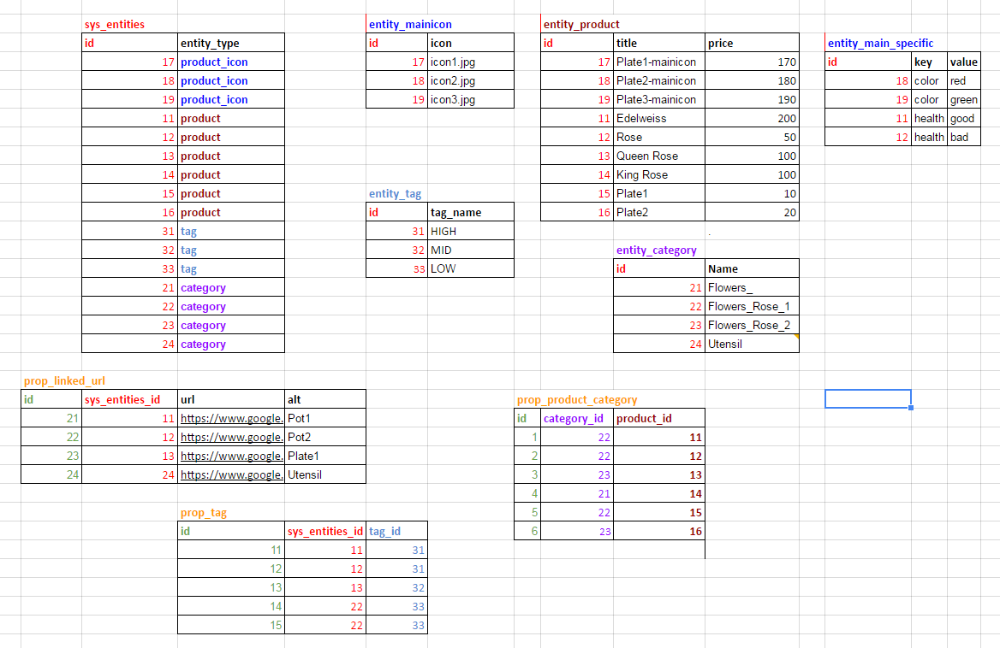

# EAV example

# Структура таблиц

Выполните 
Запустите скрипт `script/install.php`, он создаст таблицы примера в базе.  

  

Для тог, что бы создать такую структуру с данными, выполните инструкции по  
[установке библиотеки](INSTALL.md "установка библиотеки zaboy-rest") и по  
[запуску тестов](TESTS.md "Подготовка к запуску тестов").
Потом выполните скрипт `script/install.php`, он создаст таблицы с данными в базе.

Теперь должно работать:

[http://zaboy-rest.loc//api/rest/entity_tag](http://zaboy-rest.loc//api/rest/entity_tag)

[http://zaboy-rest.loc//api/rest/entity_category?select(prop_product_category)](http://zaboy-rest.loc//api/rest/entity_category?select(prop_product_category)) 

[http://zaboy-rest.loc//api/rest/entity_product?select(id,title,price,prop_linked_url)](http://zaboy-rest.loc//api/rest/entity_product?select(id,title,price,prop_linked_url))

[http://zaboy-rest.loc//api/rest/entity_product?select(id,title,price,prop_linked_url)&gt(price,50)](http://zaboy-rest.loc//api/rest/entity_product?select(id,title,price,prop_linked_url)&gt(price,50))

[http://zaboy-rest.loc//api/rest/entity_product?select(id,title,price,prop_linked_url)&gt(price,50)&limit(2,1)](http://zaboy-rest.loc//api/rest/entity_product?select(id,title,price,prop_linked_url)&gt(price,50)&limit(2,1))   

или можно читать таблицы props и sys_entities "напрямую":

[http://zaboy-rest.loc//api/rest/prop_linked_url](http://zaboy-rest.loc//api/rest/prop_linked_url)

[http://zaboy-rest.loc//api/rest/sys_entities  ](http://zaboy-rest.loc//api/rest/sys_entities  )

Писать так не рекомендуется.

